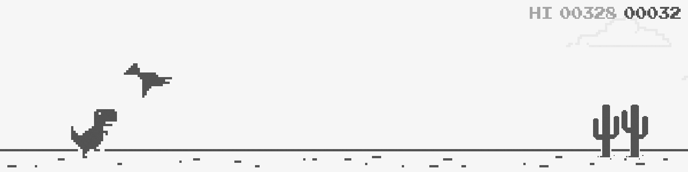
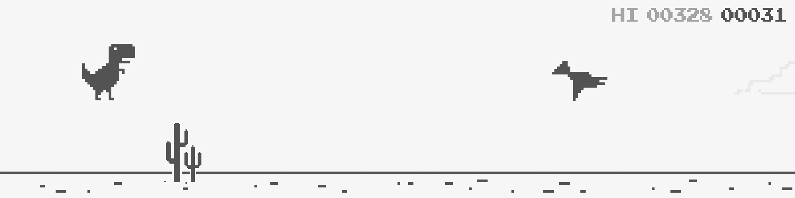
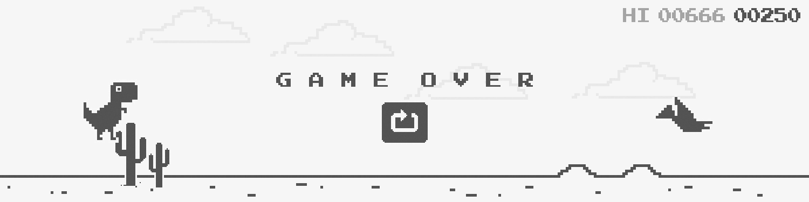

# Chrome Dinosaur Game

## Description
A Java version of Chrome Offline T-Rex Game. Some features not affecting gameplay is missing _(will be added soon!)_. Game is running on smooth **100 fps**.

## Features
  - Dynamic Background
  - Infinite Gameplay
  - Progressive Difficulty
  - Obstacles: Cactuses, Birds(Pterodactyl)
  - Jump / Duck
  - Sounds
  - Score & High Score _( File R/W )_
  - Dynamic jump height based on key holding time
  - Quick fall, pressed duck key in midair will drop Dino faster
  - Pause
  - **MORE SOON**

## Keybinds
**Jump: `ARROW UP`, `SPACE`, `W`**  
**Duck: `ARROW DOWN`, `S`**  
**Debug: <code>\`(backtick)</code>**  
**Pause: `ESC`, `P`**

## Additional Information
Possible creation of ".jar" file. Highest Scores will be stored in ".txt" file right next to ".jar" file

### Debug
  - Disables collisions
  - Shows hitboxes of Dino, Cactuses, Birds
  - Shows speed ( difficulty increase )
